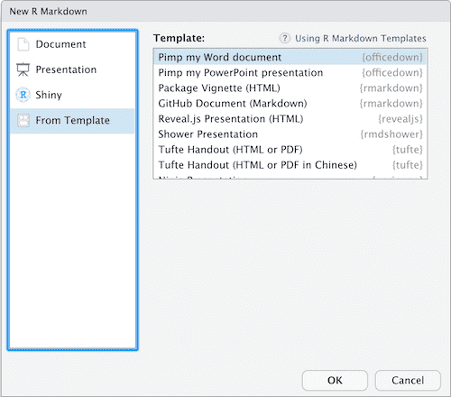
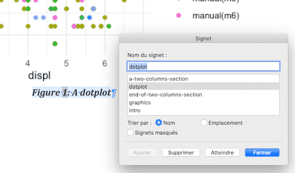
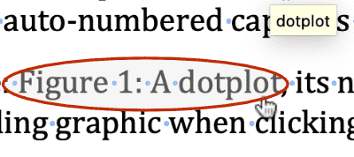

<!-- README.md is generated from README.Rmd. Please edit that file -->

[](https://travis-ci.org/davidgohel/officedown)
[](https://ci.appveyor.com/project/davidgohel/officedown)
[](https://www.tidyverse.org/lifecycle/#experimental)
[](https://cran.r-project.org/package=officedown)

> `officedown` is bringing some
> [officer](https://cran.r-project.org/package=officer) features into R
> markdown documents.

The package facilitates the formatting of Microsoft Word documents
produced by R Markdown documents by providing a range of features:

<a href="https://github.com/davidgohel/officedown"></a>

  - compatibility with the functions of the package `officer` for the
    production of “runs” and “blocks” of content (text formatting,
    landscape mode, tables of contents, etc.).
  - the ability to use the table styles defined in the “reference\_docx”
    which serves as a template for the pandoc document.
  - the ability to use two list styles defined in the “reference\_docx”,
    they are used to replace formats of ordered and unordered lists
    produced in R Markdown.
  - the replacement of captions (tables, figures and standard
    identifiers) by captions containing a Word bookmark that can be used
    for cross-referencing.
  - the replacement of cross-references by cross-references using fields
    calculated by Word. The syntax conforms to the bookdown
    cross-reference definition.

## Installation

You can install officedown from github with:

``` r
remotes::install_github("davidgohel/officedown")
```

Supported formats require some minimum
[pandoc](https://pandoc.org/installing.html) versions:

|    R Markdown output | pandoc version |
| -------------------: | :------------: |
|       Microsoft Word |    \>= 2.0     |
| Microsoft PowerPoint |    \>= 2.4     |

## Usage

### rdocx\_document

use RStudio Menu to create a document from `officedown` template.



It creates an R markdown document, parameter `output` is set to
`officedown::rdocx_document`.

``` 
---
date: "2020-04-23"
author: "David Gohel"
title: "Document title"
output: 
  officedown::rdocx_document
---


```

Note that package `officedown` need to be loaded in the Rmd.

### Captions and cross references

Original issue:

> after generating a Microsoft Word document, users have to manually
> click the image, insert a new caption with the original caption
> defined in the markdown document, insert a “:” after the “Figure X”
> text and remove the pandoc generated caption.

The R markdown format `officedown::rdocx_document` is transforming R
Markdown table and figure captions into proper Word captions that
support automatic numbering. This is especially important when merging
the generated word document into a larger document.

In the knitr chunks settings, specify:

  - the caption with the `fig.cap' (or`tab.cap’) parameter
  - specify its Word reference ID with the `fig.id' (or`tab.id’)
    parameter
  - and the paragraph style associated with the caption with the
    `fig.cap.style' (or`fig.tab.style’) parameter.

<pre>
<code>&#96;&#96;&#96;{r fig.cap="A dotplot", fig.id = "dotplot", fig.cap.style="Captioned Figure"}
ggplot(mpg, aes(displ, cty, color = trans)) + geom_point() 
&#96;&#96;&#96;</code>
</pre>

It will produce an auto-numbered caption associated with a bookmark:



You can then refer to this caption with bookdown syntax:
`\@ref(fig:dotplot)`

    This is a Word reference: \@ref(fig:dotplot), its number is computed by Word 
    and it's linked to the corresponding graphic when clicking on it.



To refer to simple document id, use syntax `\@ref(an_id)`:

    ## Title blah {#blah}
    
    This is a reference: \@ref(blah).

### Tables

With officedown, you can turn automatically data.frame to Word table.
Their format is defined by a table style located in the template
document.

<pre>
<code>&#96;&#96;&#96;{r tab.cap='mtcars', tab.id='mtcars'}
mtcars
&#96;&#96;&#96;</code>
</pre>

The same formatting scheme can be applied with a default table style for
all tables. The default table style is to be set in the YAML header of
the R Markdown document.

<pre>
<code>---
date: "2020-04-23"
author: "David Gohel"
title: "Document title"
output: 
  officedown::rdocx_document:
    tab.style: "Your Table Style"
---

&#96;&#96;&#96;{r include=FALSE}
library(officedown)
&#96;&#96;&#96;

&#96;&#96;&#96;{r}
mtcars
&#96;&#96;&#96;</code>
</pre>

You can also specify the table style and other tabular options in the
knitr chunk chunks parameters:

<pre>
&#96;&#96;&#96;{r tab.style="my second tab style"}
mtcars
&#96;&#96;&#96;</code>
</pre>

## Ordered and unordered lists

Original issue:

> after generating a Microsoft Word document, users have to change the
> style for all list items manually. The styles are already present in
> the reference\_docx file used as a template.

The R markdown format `officedown::rdocx_document` is able to change
unordered and ordered lists produced by pandoc by a default style for
each, these styles are declared in the YAML header of the R Markdown
document.

    ---
    date: "2020-04-23"
    author: "David Gohel"
    title: "Document title"
    output: 
      officedown::rdocx_document:
        ol.style: "Default ol"
        ul.style: "Default ul"
    ---

## officer compatibility

It is a little bit difficult to document as it includes many features.

Essential points are:

  - Add TOC and sections with officer block functions:

<!-- end list -->

``` r
# add a single TOC referencing all paragraphs styled with 
# style "Table title"
block_toc(style = "Table title") 
```

  - Add runs with officer run functions:

<pre>
<code>Here is a &#96;r run_pagebreak()&#96; and then some text.

Here is a &#96;r ftext("red text", fp_text(color = "red"))&#96;.

</code></pre>

Tags have been made to make less verbose and easier use. Some are
expected parameters. These parameters need to be defined as inline yaml.

### Blocks

Blocks are to be used as a paragraph in an R markdown document.

| Output type | Tag name          | R function        | Has args |
| ----------- | ----------------- | ----------------- | -------- |
| block       | BLOCK\_TOC        | block\_toc        | yes      |
| block       | BLOCK\_POUR\_DOCX | block\_pour\_docx | yes      |

<pre>The following will be transformed as a table of content:

<!--html_preserve--><span style="color:#7b1b47;">&lt;!---BLOCK_TOC---&gt;</span><!--/html_preserve-->

And the following will pour the content of an external docx file into the produced document:

<!--html_preserve--><span style="color:#7b1b47;">&lt;!---BLOCK_POUR_DOCX{docx_file:'path/to/docx'}---&gt;</span><!--/html_preserve--></pre>

### Sections blocks

Section blocks are also blocks but they need to be used in pairs:

  - landscape orientation

| Tag name                | R function                 | Has args |
| ----------------------- | -------------------------- | -------- |
| BLOCK\_LANDSCAPE\_START | block\_section\_continuous | no       |
| BLOCK\_LANDSCAPE\_STOP  | block\_section\_landscape  | no       |

<pre>The following will be in a separated section with landscape orientation

<!--html_preserve--><span style="color:#7b1b47;">&lt;!---BLOCK_LANDSCAPE_START---&gt;</span><!--/html_preserve-->

Blah blah blah.

<!--html_preserve--><span style="color:#7b1b47;">&lt;!---BLOCK_LANDSCAPE_STOP---&gt;</span><!--/html_preserve--></pre>

  - section with columns

| Tag name               | R function                 | Has args |
| ---------------------- | -------------------------- | -------- |
| BLOCK\_MULTICOL\_START | block\_section\_continuous | no       |
| BLOCK\_MULTICOL\_STOP  | block\_section\_columns    | yes      |

<pre>
The following will be in a separated section with 2 columns:

<!--html_preserve--><span style="color:#7b1b47;">&lt;!---BLOCK_MULTICOL_START---&gt;</span><!--/html_preserve-->

Blah blah blah on column 1.

<!--html_preserve--><span style="color:#7b1b47;">&lt;!---CHUNK_COLUMNBREAK---&gt;</span><!--/html_preserve-->
Blah blah blah on column 2.


<!--html_preserve--><span style="color:#7b1b47;">&lt;!---BLOCK_MULTICOL_STOP{widths: [3,3], space: 0.2, sep: true}---&gt;</span><!--/html_preserve-->
</pre>
