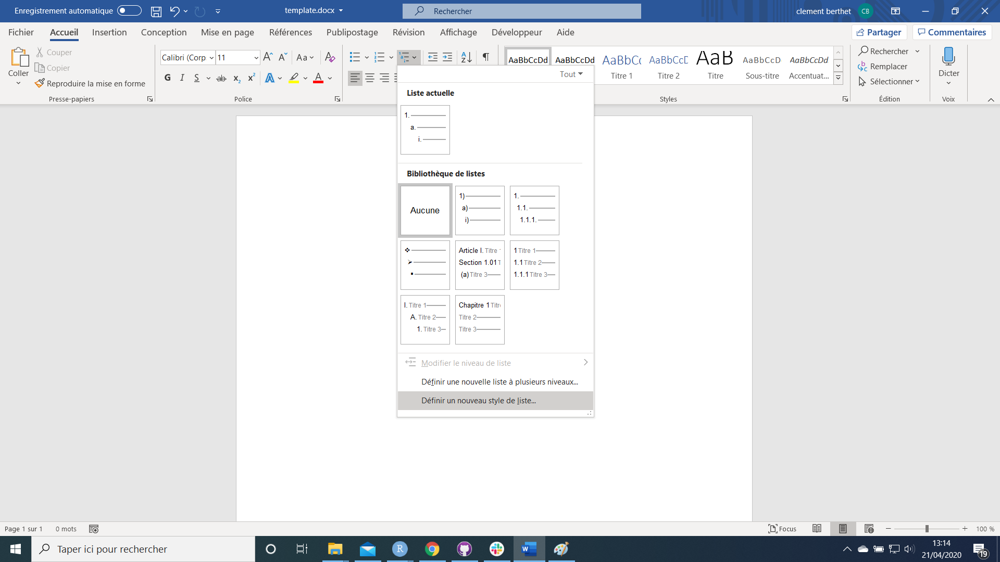

```{r, include = FALSE}
knitr::opts_chunk$set(
  collapse = TRUE,
  comment = "#>"
)
```

```{r setup}
library(officedown)
```

## Introduction 

We will see how to define a new ***list style*** in a Microsoft Word document and how to benefit from formatting with R Markdown.  
  
  
{width=80%}
  
It will be necessary to use a ***Microsoft Word document "template "*** (ex: "template.docx") to create a **new list style**.
This template will serve as a reference document for the customization of your **list style**.  
  
  
Later, the template will be filled in as the value of the `reference_docx` parameter. These parameters will be used for your future Word documents produced from R Markdown.

## Usage

1. How do you create a list style? 

As a reminder, you can consult this site which explains the steps:  

https://www.howtogeek.com/355561/how-to-create-and-work-with-multilevel-lists-in-microsoft-word/


2. Use of `reference_docx` 

The `reference_docx` option allows you to call your template (document model) containing your customizations. 

The `Rmarkdown` documentation on this topic is available via:  
https://bookdown.org/yihui/rmarkdown/word-document.html  

To enable this option, you will need to specify the `reference_docx` option in `YAML`.  

By default, your `YAML` is like this:  

`````
---
date: "`r Sys.Date()`"
author: "superman"
title: "Document title"
output: 
  officedown::rdocx_document
---
`````
  
You will need to add an option to the `YAML`: 

`````
---
date: "`r Sys.Date()`"
author: "superman"
title: "Document title"
output: 
  officedown::rdocx_document:
     reference_docx: template.docx
---
`````

Also, you can use it with `bookdown`:  

`````
---
date: "`r Sys.Date()`"
author: "superman"
title: "Document title"
output: 
  bookdown::markdown_document:
    base_format: "officedown::rdocx_document"
    reference_docx: template.docx
---
`````

All you have to do is use your custom list styles.  

## Example

1. Open Word document "template.docx" in package `officedown`.
```{r}
library(officedown)
example_docx <- system.file(package="officedown", "example/template.docx")
example_docx
```

2. Create and save your new list style in this template


