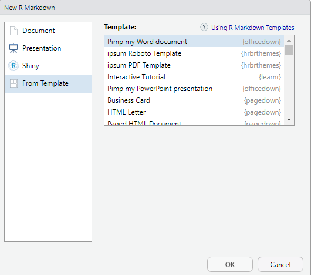

```{r, include = FALSE}
knitr::opts_chunk$set(
  collapse = TRUE,
  comment = "#>"
)
```

```{r setup}
library(officedown)
```

## Introduction 

Nous allons voir ici comment il est possible de définir un ***nouveau style de liste*** avec le logiciel **word** (https://www.office.com/).  
  
  
{width=80%}
  
  
  
L'objectif est d'utiliser un "template" (ex : "template.docx") pour creer un ***nouveau style de liste***, le sauvegarder dans le "template" et l'appliquer sur vos futurs documents word en sortie.  

1. Comment creer un style de liste ? 

Pour rappel, vous pouvez consulter ce site qui expose les étapes :  

https://www.howtogeek.com/355561/how-to-create-and-work-with-multilevel-lists-in-microsoft-word/


2. Utilisation de `reference_docx` 

Le package `officedown` https://github.com/davidgohel/officedown vous permet de creer un document word a partir de `Rmarkdown`.  

{width=60%}

Une fois le nouveau fichier `.Rmd` cree, il vous faudra preciser l'option `reference_docx` dans `YAML`.  

Par défaut, votre `YAML` est comme ceci :  

`````
---
date: "`r Sys.Date()`"
author: "superman"
title: "Document title"
output: 
  officedown::rdocx_document
---
`````
  
Il vous faudra ajouter une option dans le `YAML` : 

`````
---
date: "`r Sys.Date()`"
author: "superman"
title: "Document title"
output: 
  officedown::rdocx_document:
     reference_docx: template.docx
---
`````

Egalement, vous pouvez l'utiliser avec `bookdown` :  

`````
---
date: "`r Sys.Date()`"
author: "superman"
title: "Document title"
output: 
  bookdown::markdown_document:
    base_format: "officedown::rdocx_document"
    reference_docx: template.docx
---
`````

Il ne vous reste plus qu'a utiliser vos styles de liste personnalisés.
