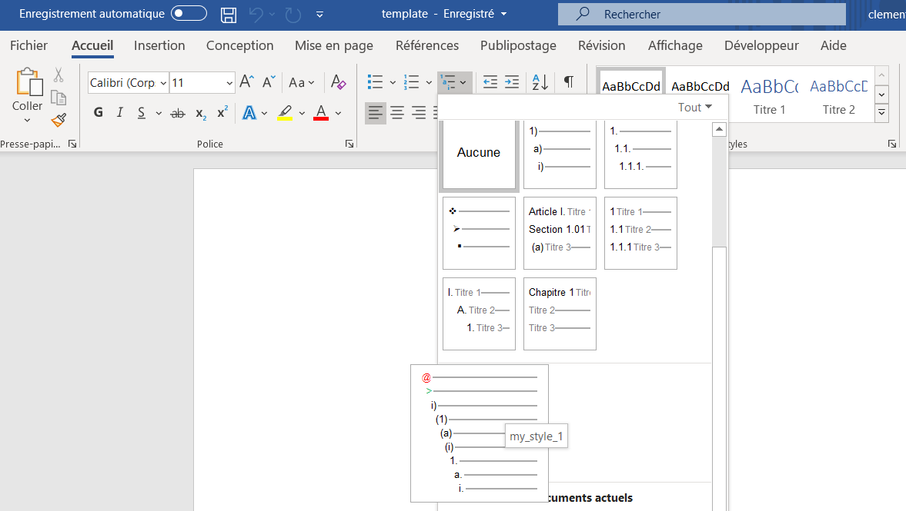
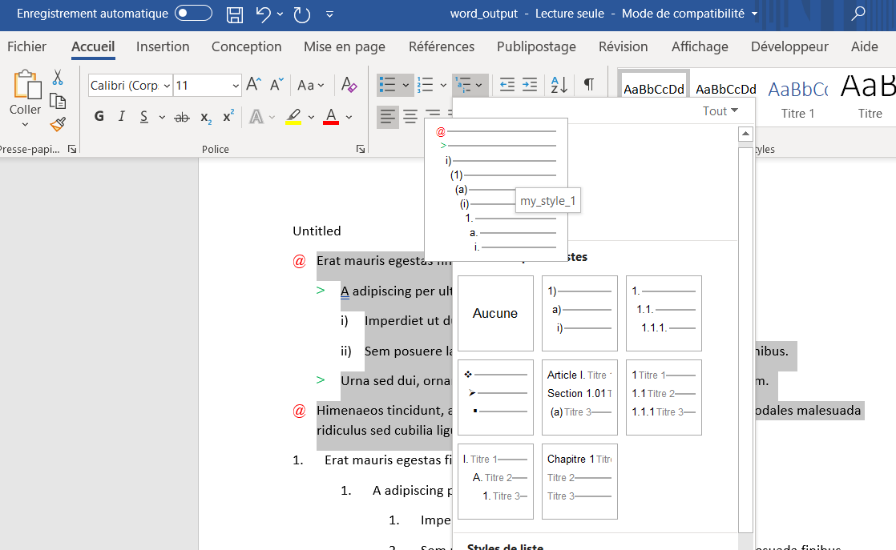

```{r, include = FALSE}
knitr::opts_chunk$set(
  collapse = TRUE,
  comment = "#>"
)
```

```{r setup}
library(officedown)
```

## Introduction 

We will see how to define a new ***list style*** in a Microsoft Word document and how to benefit from formatting with `R Markdown`.  
  
  
{width=80%}
  
It will be necessary to use a ***Microsoft Word document "template "*** (ex: "template.docx") to create a **new list style**.
This template will serve as a reference document for the customization of your **list style**.  
  
  
Later, the template will be filled in as the value of the `reference_docx` parameter. These parameters will be used for your future Word documents produced from `R Markdown`.

## Usage

1. How do you create a list style? 

As a reminder, you can consult this site which explains the steps:  

https://www.howtogeek.com/355561/how-to-create-and-work-with-multilevel-lists-in-microsoft-word/


2. Use of `reference_docx` 

The `reference_docx` option allows you to call your template (document model) containing your customizations. 

The `R Markdown` documentation on this topic is available via:  
https://bookdown.org/yihui/rmarkdown/word-document.html  

To enable this option, you will need to specify the `reference_docx` option in `YAML`.  

By default, your `YAML` is like this:  

`````
---
date: "`r Sys.Date()`"
author: "superman"
title: "Document title"
output: 
  officedown::rdocx_document
---
`````
  
You will need to add an option to the `YAML`: 

`````
---
date: "`r Sys.Date()`"
author: "superman"
title: "Document title"
output: 
  officedown::rdocx_document:
     reference_docx: template.docx
---
`````

Also, you can use it with `bookdown`:  

`````
---
date: "`r Sys.Date()`"
author: "superman"
title: "Document title"
output: 
  bookdown::markdown_document:
    base_format: "officedown::rdocx_document"
    reference_docx: template.docx
---
`````

All you have to do is use your custom list styles.  

## Example

### Create a new R Markdown file

Open a new `R Markdown` file and choose `output: word_document`.  
  
Now replace the content in your new `R Markdown` file (after first chunk) by the text below.  
  
As you can see, special character "*" or "1." with tabbed product shaping in you Word document output.  

the main interest is to no longer manage list styles in your `R Markdown` document and use your own custome list style in Word document output.  
  
**Text to copy:**  

* Erat mauris egestas finibus tincidunt sed in rhoncus a tellus etiam. 
    - A adipiscing per ultricies justo tellus lorem. 
        - Imperdiet ut dui primis, sed gravida, at sed nulla. 
        - Sem posuere lacus consequat inceptos dapibus duis malesuada finibus. 
    - Urna sed dui, ornare, eu turpis mus pellentesque amet amet bibendum. 
* Himenaeos tincidunt, auctor dapibus scelerisque, montes nunc faucibus 
sodales malesuada ridiculus sed cubilia ligula.


1. Erat mauris egestas finibus tincidunt sed in rhoncus a tellus etiam. 
    1. A adipiscing per ultricies justo tellus lorem. 
        1. Imperdiet ut dui primis, sed gravida, at sed nulla. 
        2. Sem posuere lacus consequat inceptos dapibus duis malesuada finibus. 
    2. Urna sed dui, ornare, eu turpis mus pellentesque amet amet bibendum. 
2. Himenaeos tincidunt, auctor dapibus scelerisque, montes nunc faucibus 
sodales malesuada ridiculus sed cubilia ligula.


Lorem dolor interdum orci eros pellentesque semper tristique, sodales, et sed
ut! Porta mattis natoque et. Ac facilisi ipsum viverra elementum vestibulum
ligula amet enim magnis luctus ullamcorper. Rhoncus rhoncus elit in at nisl.
Tincidunt habitant sit.


* Aptent conubia quam montes id sagittis.
    - Mattis nisi nascetur, aliquam duis ex, tristique.
        - Imperdiet ut dui primis, sed gravida, at sed nulla. 
        - Donec ligula nulla ac. Nisl ac at accumsan sagittis eros felis lobortis amet 
        nec phasellus urna bibendum sapien.
    - Eu dui ac id, dictum proin consectetur convallis.
* Facilisi eu lectus mauris lorem. Et sed sapien pellentesque sed etiam vehicula. 
* In porttitor id lorem eu efficitur, nisl dis!


### Use YAML 

In the new `R Markdown` file, use option `reference_docx`:  
  
`````
---
title: "Untitled"
output: 
  officedown::rdocx_document:
     reference_docx: template.docx
---
`````

By default, i create a list style "my_style_1", you can create your own style.  

{width=80%}

Now in your Word output document apply your own style from your "template" and see what happens.  

{width=80%}

Now you can save time and no longer worry about formatting lists in your `R Markdown` document, just use your "template".
